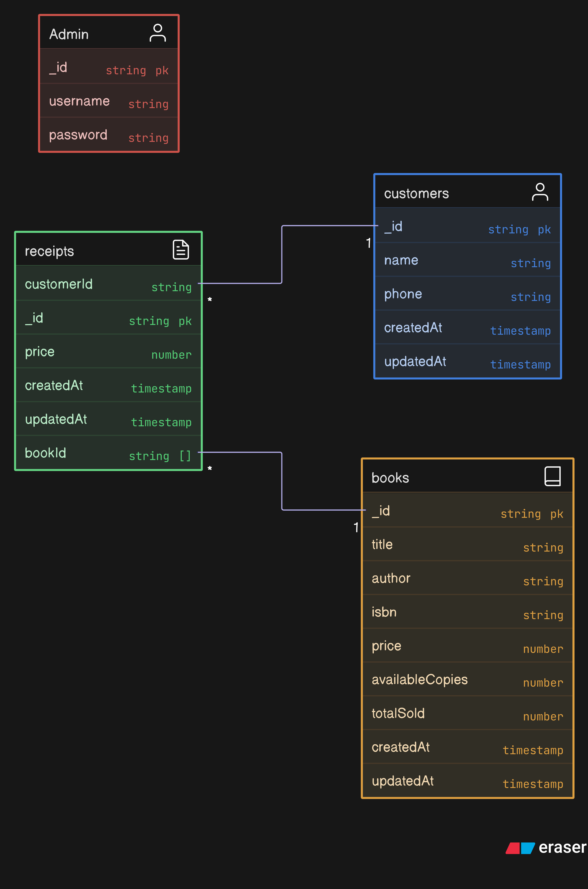

# LMS – Library Management System API

## Overview

The Library Management System (LMS) API is a robust backend application designed to streamline and manage library operations such as:

- Book inventory and sales tracking
- Customer management with duplicate detection
- Sales receipts generation
- Best-selling book analytics

Built with Node.js, Express, and MongoDB, this API adopts modern backend development practices including JWT-based authentication, request validation via Joi, layered architecture for scalability, and full testing coverage using Jest and Supertest. It is ideal for libraries, bookshops, or any institution managing book-related transactions.

---

## System Architecture

The LMS backend is built using a layered architecture, which separates concerns across middleware, validation, controllers, and models for scalability and maintainability.

### Request Lifecycle

```
Client → Middleware (JWT + Validation) → Controller (Route Handler) → Mongoose (Database) → Response
```

### Project Structure

```
LMS/
├── config/              # MongoDB connection logic
├── controllers/         # Route handler logic
├── middlewares/         # JWT auth and request validation
├── models/              # Mongoose schemas for each resource
├── routes/              # API endpoint definitions
├── validators/          # express-validator schemas for request validation
├── __test__/            # Jest + Supertest tests
├── api.yaml             # Swagger API documentation
├── server.js            # Application entry point
└── .env                 # Environment configuration
```

### Architecture Diagram


---

## Database Design

The database schema is built on MongoDB and models the following relationships:

- `books`: Tracks title, author, pricing, stock, and sales data.
- `customers`: Stores customer name and contact details with duplication control.
- `receipts`: Logs sales, links to customers and book quantities.

### Schema Diagram



---

## Authentication and Middleware

### JWT Authentication

All protected routes require a valid JWT token in the request header:

```
Authorization: Bearer <your_token>
```

The middleware verifies token validity. If the token is missing or invalid, the server returns a 401 or 403 response. Upon validation, the request proceeds to the corresponding route handler.

### Request Validation

express-validator is used to define validation schemas for all route inputs. Validation is applied before business logic execution. Errors are caught early and returned in a consistent format.

Examples of validation files include:

- `bookValidator.js`
- `customerValidator.js`
- `receiptValidator.js`

---

## API Documentation

The LMS API is documented using Swagger (OpenAPI v3), providing a visual and interactive interface to test and explore API endpoints.

### Endpoint Groups

- `/auth` – User registration and login
- `/books` – Book inventory and management
- `/customers` – Customer record operations
- `/receipts` – Sales receipts creation and updates
- `/receipts/bestsellers` – Analytics on top-selling books

### Access Swagger UI

Once the server is running, the documentation is available at:

```
http://localhost:3000/api-docs
```

---

## Testing

All routes are tested using Jest and Supertest, ensuring correctness, security, and resilience under different conditions.

### Test Coverage Includes

- Authentication with hashed passwords
- Full CRUD for books, customers, and receipts
- Validation and edge cases (e.g., insufficient stock, duplicate data)
- Access control via JWT middleware

### Run Tests

To run all tests:

```bash
npm test
```

To run a specific test file:

```bash
npx jest __test__/receipt.test.js
```

> **Note:**  
> Make sure your test database (`MONGO_URI_TEST`) is **up and running**, and that it is correctly referenced in both:
>
> - Your `.env` file (as `MONGO_URI_TEST`)
> - The Jest test setup or individual test files
>
> This ensures the tests connect properly to the correct database and avoids connection or duplication errors when running multiple test suites.

---

## Local Setup

### Prerequisites

- Node.js (v18 or higher recommended)
- MongoDB instance (local or remote)
- npm (or yarn)

### Installation Steps

1. Clone the repository:

```bash
git clone https://github.com/sherbeenyy/LMS.git
cd LMS
```

2. Install dependencies:

```bash
npm install
```

3. Create a `.env` file in the root directory and add the following:

```env
PORT=3000
MONGODB_URI=mongodb://localhost:27017/lms
MONGODB_URI_TEST=mongodb://localhost:27017/lms_test
JWT_SECRET=your_jwt_secret_key
```

4. Start the development server:

```bash
npm run dev
```

- API Base URL: `http://localhost:3000`
- Swagger Docs: `http://localhost:3000/api-docs`

---

## Core Features

| Feature           | Description                                              |
| ----------------- | -------------------------------------------------------- |
| Book Management   | Add, update, delete, and retrieve book records           |
| Customer Handling | Create and manage customer data with duplication control |
| Receipt System    | Track customer purchases and book stock adjustments      |
| Best Sellers      | Retrieve analytics on top 5 best-selling books           |
| Secure Access     | JWT authentication for all protected routes              |
| Full Testing      | Complete test coverage for all routes and edge cases     |

---

## Built With

- Node.js – JavaScript runtime environment
- Express.js – Web framework for Node.js
- MongoDB & Mongoose – NoSQL database and ORM
- express-validator – Input validation library
- JWT – JSON Web Token authentication
- Swagger (YAML) – API documentation
- Jest + Supertest – Testing frameworks

---

## Future Enhancements

- Role-based access control (admin, librarian, etc.)
- Book borrowing and return system with due dates
- Notification service (email or SMS)
- Data export and report generation

---

## License

This project is licensed under the MIT License.

---

## Author

Developed by **Ahmed Hesham Elsherbeeny**
